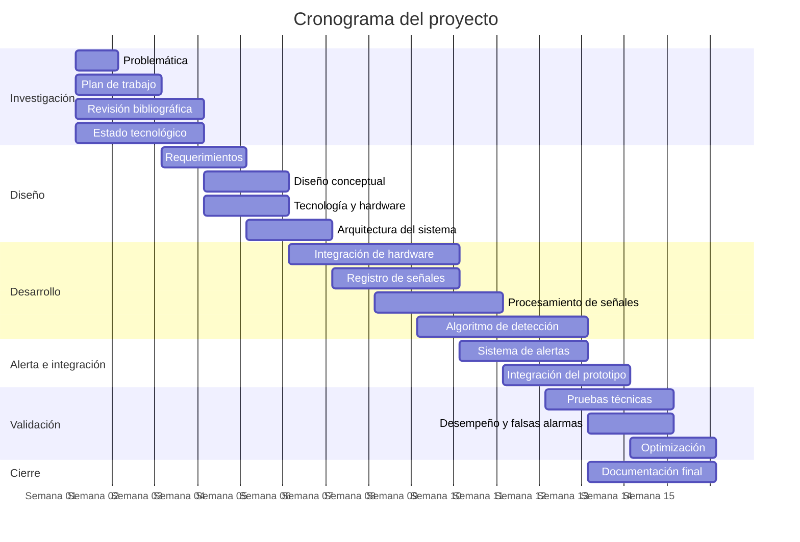

# Proyecto de Biodiseño - Grupo 4
| Integrantes                     | Código de estudiante |
|---------------------------------|:--------------------:|
| Jean Pierre Roy Cortez Alban    | 76567780             |
| Abigail Valentina Vasco Panduro | 72876106             |
| Naun Aldair Cari Quispe         | 60758913             |
| César Roberto García Bonilla    | 72005834             |
| Rodrigo Emiliano Salas Cano     | 61010375             |

# Cronograma del proyecto

## Sistema de monitorización nocturna de crisis tonicoclónicas

### Actividades y horas estimadas

| N.° | Actividad | Semanas | Horas |
|---:|---|:---:|---:|
| 1 | Definición y delimitación de la problemática | 1 | 5 |
| 2 | Elaboración del plan de trabajo | 1–2 | 4 |
| 3 | Revisión bibliográfica y evidencia clínica | 1–3 | 8 |
| 4 | Análisis del estado de la tecnología | 1–3 | 8 |
| 5 | Definición de requerimientos del sistema | 3–4 | 6 |
| 6 | Diseño conceptual de la solución | 4–5 | 6 |
| 7 | Selección de tecnologías y hardware | 4–5 | 7 |
| 8 | Diseño de la arquitectura del sistema | 5–6 | 9 |
| 9 | Desarrollo e integración del hardware | 6–9 | 12 |
| 10 | Adquisición y registro de señales | 7–9 | 10 |
| 11 | Procesamiento de señales | 8–10 | 10 |
| 12 | Desarrollo del algoritmo de detección | 9–12 | 14 |
| 13 | Desarrollo del sistema de alertas | 10–12 | 8 |
| 14 | Integración del prototipo | 11–13 | 12 |
| 15 | Pruebas técnicas del sistema | 12–14 | 10 |
| 16 | Evaluación del desempeño y falsas alarmas | 13–14 | 8 |
| 17 | Optimización del prototipo | 14–15 | 8 |
| 18 | Documentación y presentación final | 13–15 | 6 |
| **Total** | | | **151 h** |

## Diagrama de Gantt

